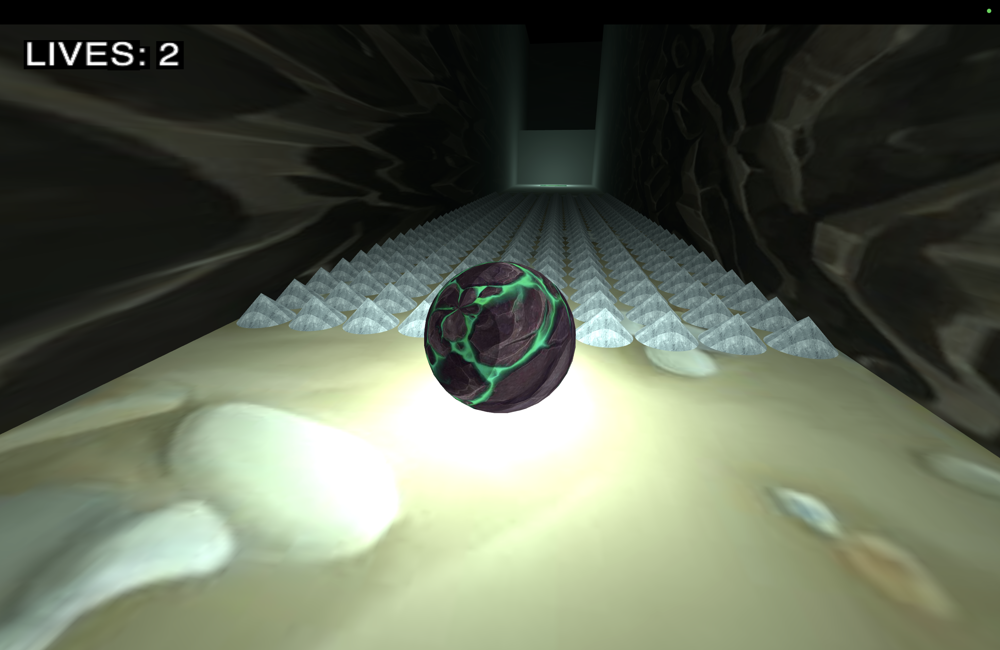

## ProgettoCG

This is a C++ Vulkan project made for the course "Computer Graphics" during my Computer Science Engineering Master Degree at Politecnico di Milano.
It is a labyrinth videogame where you play as a ball. Find the way out!

## Use

1) Build the project using "cmake build" in the terminal in the project folder.
2) Run the project using "./build/ProgettoCG" in the terminal in the project folder.

## Requirements

1) Have cmake installed.
2) Have a C++ compiler installed.
3) Have Vulkan, GLM, GLFW, SFML installed.

## How to play

1) Be careful to spikes, don't loose lives.
2) Jump through the obstacles.
3) Collect items to make the level easier.
4) Find the win item.

## Commands

1) Move with WASD.
2) Move visual with arrows.
3) Jump with spacebar.
4) Interact with E.

## Screenshots

